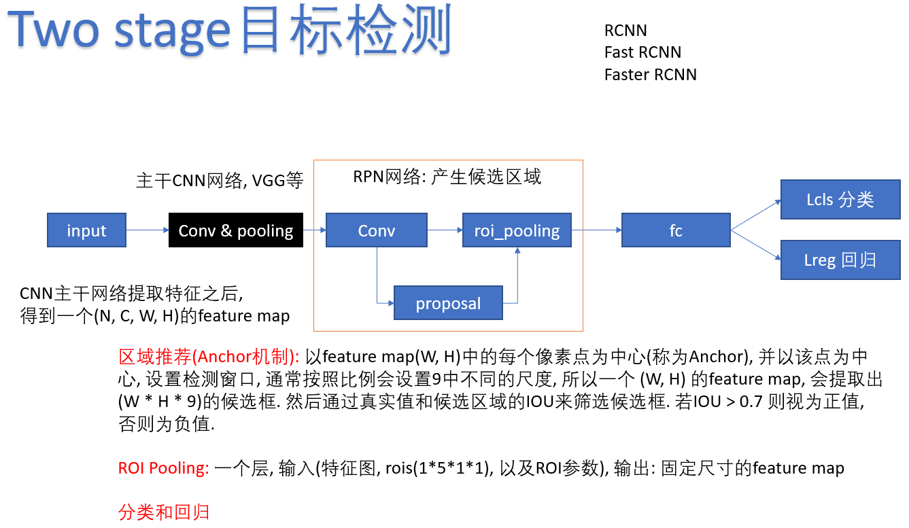
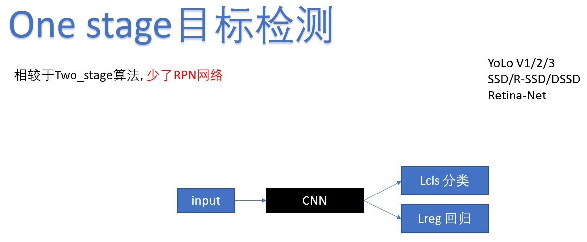
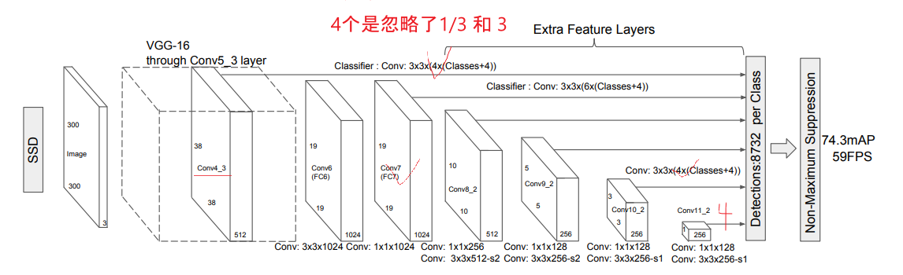
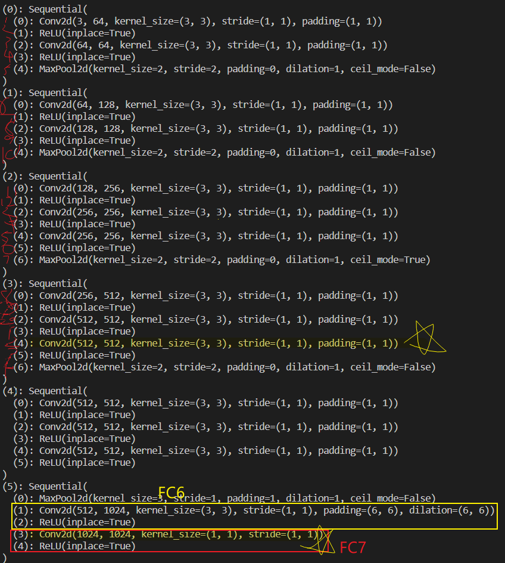
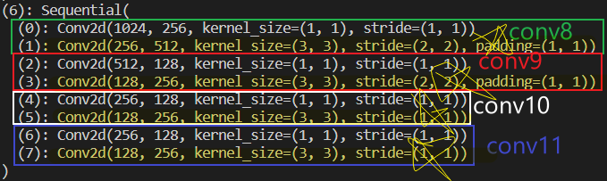
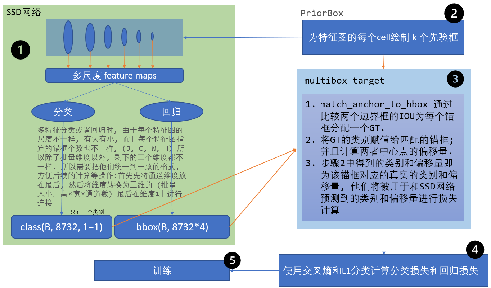
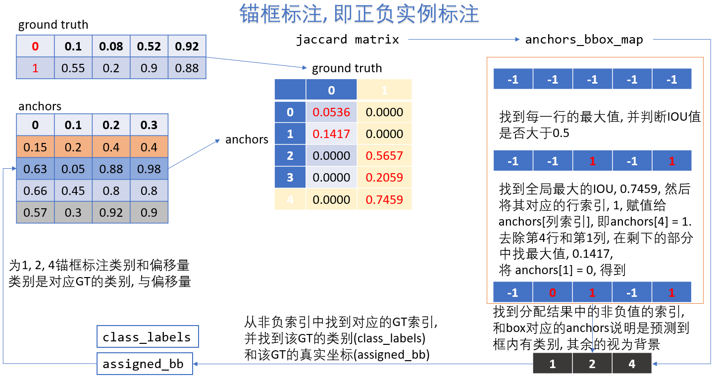
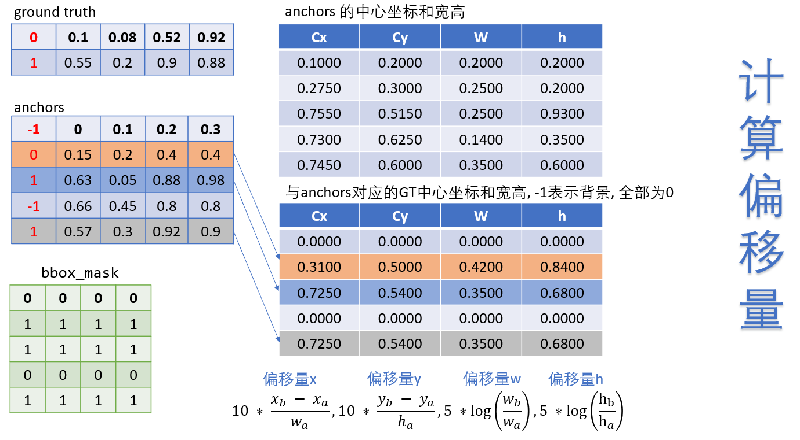

# 目标检测

## 术语
- 边缘框: bounding box, 表达方式有(左上X, 左上y, 右下X, 右下y) 或者 (左上X, 左上y, 宽, 高)
- 锚框: Anchor box, 以每个像素为中心的, 有多个缩放比和宽高比不同的边缘框. 这些框称为锚框.
- 真实边界: ground-truth bounding box, 目标标注的真实边缘框

## 算法类别
1. Two-stage目标检测算法:
    - 通过一个完整的卷积神经网络提取对候选区域目标的特征描述
    - 典型代表: RCNN, Fast RCNN, Faster RCNN
    - 准确率高, 但是速度相对One-stage较慢



2. One-stage目标检测算法:
   - 使用CNN卷积特征
   - 直接回归物体的类别概率和位置坐标值(并没有Region proposal)
   - 准确度低, 速度较two-stage较快



## IOU
- IOU用来计算两个框之间的相似度, 0表示无重叠, 1表示重合
- 给定两个集合A 和 B, IOU为两者的交集和并集的比例, i.e.,
  $$ IoU(A, B) = \frac{|A \bigcap B|}{|A \bigcup B|} $$
- 思路
  - 获取两个矩形相交部分的左上角和右下角坐标.
    给定两个矩形分别为: 
        boxes1 = [[2, 2, 5, 5]] 
        boxes2 = [[3, 2, 6, 4]]
    1. 获取两个矩形的左上角的坐标的最大值: 注意是获取每个维度上的最大值与最小值, 而不是从两个点里选最大的点或者最小的点
        即从 [[2, 2]] [[3, 2]] 中分别获取两个维度上的最大值, 即得到 [3, 2]
    2. 获取两个矩形右下角的坐标的最小值
        即从 [[5, 5]] [[6, 4]] 中分别获取两个维度上的最小值, 即得到 [5, 4]
    3. 两个坐标围成的区域即为两个矩形的交集矩形
        点(3, 2) 和 点(5, 4)所围成的矩形就是交集的面积
```
def get_IoU(boxes1, boxes2):
    box_area = lambda boxes: ((boxes[:, 2] - boxes[:, 0]) * (boxes[:, 3] - boxes[:, 1]))

    areas1 = box_area(boxes1)
    areas2 = box_area(boxes2)

    inter_upperlefts = torch.max(boxes1[:, None, :2], boxes2[:, :2])
    inter_lowerrights = torch.min(boxes1[:, None, 2:], boxes2[:, 2:])

    # 两个点的差值不能小于0.
    # clamp(input, min, max) 将input的值压缩在 [min, max]的范围内, 若不指定min和max, 则没有上下边界
    # inters中包含两个值[[x, y]], 分别表示相交矩阵的长和宽
    inters = (inter_lowerrights - inter_upperlefts).clamp(min=0)
    # 交集矩阵的面积
    inter_areas = inters[:, :, 0] * inters[:, :, 1]
    # 并集的面积: 矩形A + 矩形B - 交集矩形面积
    union_areas = areas1[:, None] + areas2 - inter_areas
    IoU = inter_areas / union_areas
    return IoU
```


# 经典算法
## SSD - One_stage
- Single Shot Detector
- 直接回归目标类别和位置
- 不同尺度的特征图上进行预测
- 端到端的训练
- 能够在图像分辨率比较低时依然能保证检测精度 

### SSD架构
#### 整体架构


#### 架构细节



#### 流程



